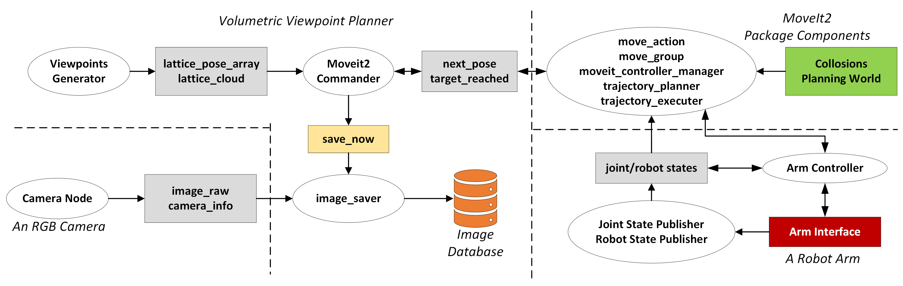

## Volumetric Viewpoint Planner

This repository generates a set of viewpoints in a volume to scan an object. The volume surface and the point scattering features can be specified by user. The packages are designed especially for a robot arm scanning a plant with a camera to complete perception tasks, such as 3D resconstruction, segmentation, and selective harvesting. The repository can generate viewpoints for the arm, command them randomly or within an order and save RGB images when the arm reaches to a viewpoint. 

The workflow of the repository is illustrated below.

 

### Installation/Running

1. **Open in Visual Studio Code:**

   Open the cloned repository in VSCode. VSCode will prompt you to "Reopen in Container." Alternatively, you can use the command palette (`Ctrl+Shift+P`) and search for the "reopen in container" command.

   


   Then this will promote you with the following two options:

   


   You may select the base image according to your targeted application. For instance, if the nodes do not require GPU processing tasks, it is preferable to use the default devcontainer as it is more lightweight.

2. **Accessing the Desktop Interface:**
   Open the user interface by navigating to the PORTS tab in VSCode, selecting port `6080` (or port `5801` for the CUDA-OpenGL version), and opening it in the browser.

   

3. **Getting Started: Build Packages**

   ```bash
   cd ${your_ws} && colcon build
   source install/setup.bash
   ```

4. **Running the Volumetric Viewpoint Generator:**

   Run following launch file to publish lattice points (viewpoints) simultaneously as point cloud and pose array messages.

   ```bash
   ros2 launch viewpoint_generator lattice_publisher.launch.py
   ```
   For more details on viewpoint generator, please refer to [documentation](src/viewpoint_generator/README.md#viewpoint-generator)

5. **Arm and Camera Setup**

   According to the planned camera-arm setup, the necessary packages should be installed and executed at this stage.

   In our case, the default setup includes Franka Emika Panda Robot and Flir Blackfly-s Color camera. The following information describes how to install and run them.

   **For arm,**

   ```bash
   cd ${your_ws}/src
   git clone --branch humble https://github.com/LCAS/franka_arm_ros2
   cd franka_arm_ros2 && git checkout humble
   cd ${your_ws} && colcon build --cmake-args -DCMAKE_BUILD_TYPE=Release -DFranka_DIR:PATH=/libfranka/build`
   source install/setup.bash
   ```
   libfranka (version 0.8.0) has been already installed while building docker image. 

   For more details, please refer to [documentation](https://github.com/LCAS/franka_arm_ros2)

   **For camera,**

   ```bash
   cd ${your_ws}/src
   git clone --branch humble-devel https://github.com/LCAS/flir_camera_driver
   cd flir_camera_driver && git checkout humble-devel
   cd ..
   rosdep install --from-paths src --ignore-src
   colcon build --symlink-install --cmake-args -DCMAKE_BUILD_TYPE=RelWithDebInfo -DCMAKE_EXPORT_COMPILE_COMMANDS=ON
   source install/setup.bash
   ```

   For more details, please refer to [documentation](https://github.com/LCAS/flir_camera_driver/blob/humble-devel/spinnaker_camera_driver/doc/index.rst)

   To run arm platform (arm + camera):
   ```bash
   ros2 launch spinnaker_camera_driver driver_node.launch.py camera_type:=blackfly_s serial:="'<camera-serial>'"
   ros2 launch franka_moveit_config moveit_real_arm_platform.launch.py robot_ip:=<fci-ip> camera_type:=blackfly_s serial:="'<camera-serial>'" load_camera:=True planner:=<planner_name>
   ```
   Example `robot_ip:=172.16.0.2`, `serial:="'22141921'"`, `planner:=pilz_industrial_motion_planner/CommandPlanner` 

   To test on fake hardware, add `use_fake_hardware:=True` argument to the launch file.

6. **Running the Moveit2 Commander Recorder:**

   Run the following launch file to generate pose commands for the arm using MoveIt2 based on viewpoints' poses (including point positions and orientations) and capture images at the viewpoints.

   ```bash
   ros2 launch moveit2_commander_recorder moveit_commander.launch.py
   ```
   For more details on moveit2 commander recorder, please refer to [documentation](src/moveit2_commander_recorder#franka-arm-moveit-commander-for-plant-inspection)


