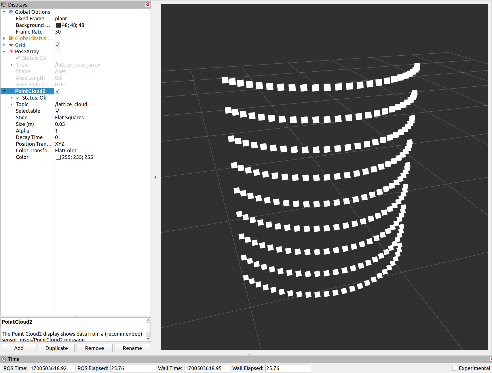
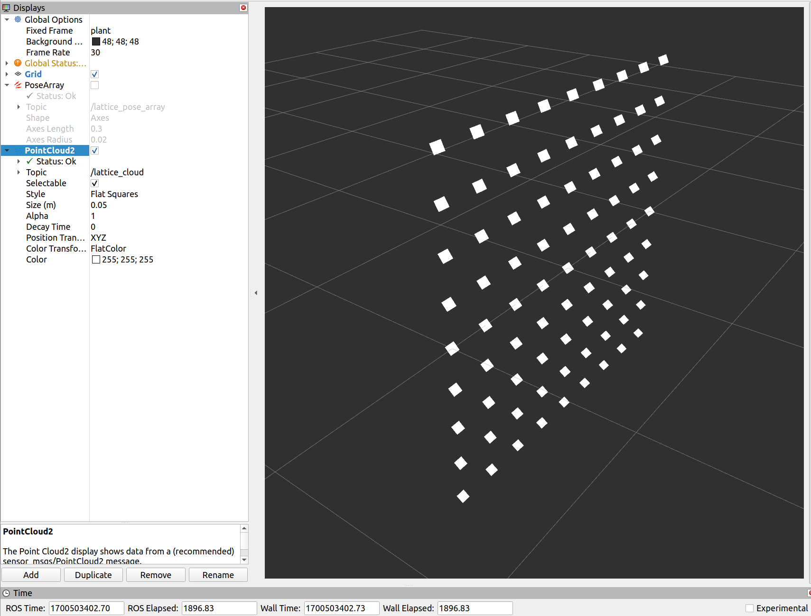
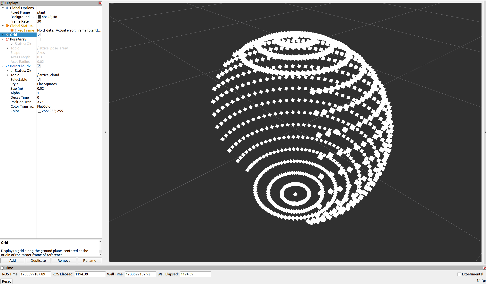

# Viewpoint Generator  

Lattice viewpoints for a robot arm to capture the plant from different 3D points in space, part of the Agri-OpenCore (AOC) project

This package is developed for **ROS2 humble** release

# Getting Started 

Clone the repository and build it

```bash
mkdir -p ${your_ws}/src 
cd ${your_ws}/src
git clone --branch humble-dev https://github.com/{owner}/viewpoint_generator.git
cd viewpoint_generator && git checkout humble-dev
cd ${your_ws} && colcon build
source install/setup.bash
```

# Generate Lattice Poses (Viewpoints Array)

Run the following launch file to generate lattice viewpoint poses (including point positions and orientations)

```bash
ros2 launch viewpoint_generator lattice_publisher.launch.py
```

1. PointCloud2 message for only positions of lattice points (viewpoints)
2. PoseArray message for both positions and orientations (poses) of lattice points

  

# Configuration of Node

In config folder, **params.yaml** can be used to configure the node. 

* **"surface"** parameter for chosing "planar", "cylindrical" or "spherical" surfaces to generate points
* **"towards"** parameter determines whether lattice points will toward to origin ("origin"), center axis ("axisZ") of the plant or "fixed" orientation selected by user via **fixed_orientation** parameter
* **"order"** parameter determines whether the viewpoints will ve sorted vertically ("vertical") or horizontally ("horizontal")
* **"frame_id"** parameter is to define the generated poses according to which frame
* **"x_lb_ub", "y_lb_ub", "z_lb_ub"**, **"theta_hor_lb_ub"**, and **"theta_ver_lb_ub"** parameters describes the upper and lower boundaries of the surface for the lattice points
* **"x_stepSize", "y_stepSize", "z_stepSize"**, **"theta_hor_stepSize"** , and **"theta_ver_stepSize"** parameters describes the frequency of points in each dimension
* **"rate"** parameter defines publishing frequency of the lattice points
* **"fixed_orientation"** to choose a specific orientation value for the lattice points
